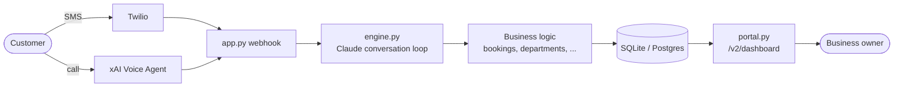

# Roster

Roster is a managed AI workforce for home-service businesses (HVAC,
plumbing, and similar trades first). Instead of selling a tool the owner has
to configure, Roster builds, deploys, and runs each business's AI employees
for them — the first being **Frontdesk**: missed call → instant AI text-back
→ answers the customer → books the job. See [`ROSTER.md`](ROSTER.md) for the
full thesis and [`SALES.md`](SALES.md) for the current pitch.

This repo is the whole product: one FastAPI application, server-rendered
dashboard, SQLite/Postgres storage, no separate frontend build.

## Repository structure

```
agent/          the application — see agent/README.md and docs/architecture.md
docs/           architecture, API, development, deployment, testing reference
concepts/       exploratory design concepts (explicitly marked, not the live site)
marketing/      the outbound acquisition system (docs/campaign material)
outreach/       live sales scripts, CRM (pipeline.csv), and scorecard tooling
pitch-deck/     investor deck sources + generated PDFs
archive/        superseded material, kept for reference rather than deleted

ARCHITECTURE.md frozen customer-dashboard invariants — read before touching /v2/dashboard*
DESIGN.md       design tokens/decisions — read before any visual change
ROADMAP.md      build priorities and the current build-freeze status
SALES.md        pitch, ICP, objection handling
CUSTOMER.md     living log of pilot/customer calls
SPRINT-10-CUSTOMERS.md   the active 30-day customer-acquisition sprint plan
```

## Architecture overview



Full detail, including the background-job pipeline (Revenue Recovery,
Referrals, Reviews) and the frozen dashboard view-model layering, is in
[`docs/architecture.md`](docs/architecture.md).

## Local development

```bash
cd agent
python3 -m venv .venv && source .venv/bin/activate
pip install -r requirements.txt
cp .env.example .env   # fill in ANTHROPIC_API_KEY and ADMIN_PASSWORD at minimum
./run.sh
```

Open http://127.0.0.1:8000/clients (HTTP Basic auth with your `ADMIN_PASSWORD`)
to see a seeded demo business. Full walkthrough, including the live-voice and
Revenue Recovery setup, in [`agent/README.md`](agent/README.md); env var
reference in [`docs/development.md`](docs/development.md).

## Running tests

```bash
cd agent && source .venv/bin/activate && pytest
```

See [`docs/testing.md`](docs/testing.md) for how the 78-file suite is
organized.

## Deployment

Deploys to Railway with root directory `agent/`. Summary in
[`docs/deployment.md`](docs/deployment.md); full step-by-step in
[`agent/README.md`](agent/README.md#deploying-to-railway).

## Troubleshooting

- **Dashboard returns 503** — `ADMIN_PASSWORD` (or `SESSION_SECRET_KEY` in
  production) isn't set; both fail closed on purpose rather than serving
  insecurely.
- **Voice call doesn't reach the app locally** — xAI reaches you via a
  webhook, so you need a public URL even for local testing
  (`ngrok http 8000`); see `agent/README.md`.
- **More than one Railway worker** — don't. SQLite is single-writer and the
  conversation lock is process-local; see
  [`docs/architecture.md`](docs/architecture.md#why-sqlite-and-one-worker).
- **No scheduler/tick output in Railway logs** — check `PYTHONUNBUFFERED=1` is
  set. Without it, background `print()` output can sit in a buffer instead of
  reaching the log stream, even though the scheduler is running correctly; see
  [`docs/deployment.md`](docs/deployment.md).

## Coding standards

See [`docs/coding-guidelines.md`](docs/coding-guidelines.md) for the
conventions already in use (idempotent write paths, registries-as-code,
fail-closed secrets, naming). Before touching `/v2/dashboard*`, read
[`ARCHITECTURE.md`](ARCHITECTURE.md) in full — it's a PR-review checklist,
not background reading. Before any visual change, read
[`DESIGN.md`](DESIGN.md).

## Contributing

See [`CONTRIBUTING.md`](CONTRIBUTING.md). Security issues: see
[`SECURITY.md`](SECURITY.md). Notable changes: see [`CHANGELOG.md`](CHANGELOG.md).
