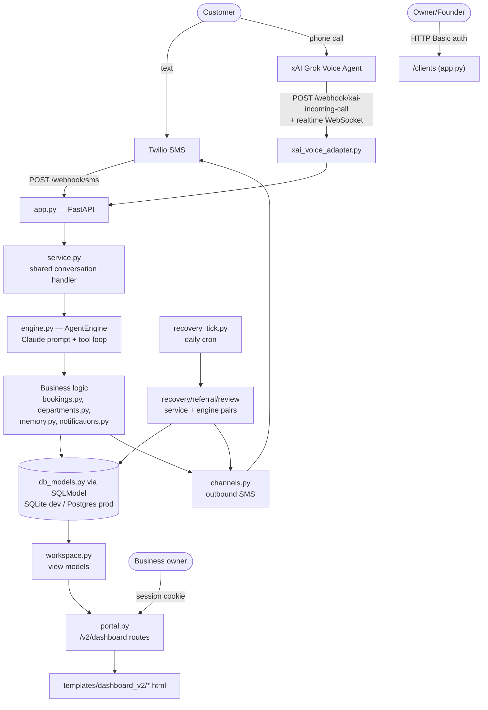

# Architecture (as-is)

This documents the system **as it exists today**. It does not propose changes.
For the frozen, PR-enforced invariants of the customer dashboard specifically,
see [`../ARCHITECTURE.md`](../ARCHITECTURE.md) — that file outranks this one on
anything it covers.

The whole application is a single Python package at [`../agent/`](../agent/):
one FastAPI process, SQLite (or Postgres) via SQLModel, server-rendered Jinja
templates, no separate frontend build. There is no `backend/`, `frontend/`, or
`api/` split — everything lives in `agent/*.py`.

## Request flow

Two independent entry points reach the same conversation core:
- **SMS** — Twilio calls `POST /webhook/sms` on every inbound text. Reply goes
  back inline as TwiML; no outbound Twilio credentials needed for replies.
- **Voice** — xAI's Grok Voice Agent holds one realtime WebSocket open per call
  (`xai_voice_adapter.py`), rather than a per-turn HTTP request. See
  [`../agent/README.md`](../agent/README.md#ai-receptionist-xai-grok-voice-agent-api-live-voice)
  for the full call lifecycle — this integration is flagged there as
  **unverified against a real call** as of 2026-07-16.

Both paths converge on `service.py`, which is the one shared turn-handling
function used by the dashboard's test-chat, the SMS webhook, and (indirectly)
the voice adapter — there is deliberately only one place a conversation turn
is processed.

## Core pieces

| Layer | Files | Responsibility |
|---|---|---|
| Entry points | `app.py`, `portal.py` | Founder console + webhooks (`app.py`); customer self-serve portal + `/v2/dashboard*` (`portal.py`) |
| Conversation | `engine.py`, `service.py` | Builds the Claude system prompt, runs the tool loop, shared by all channels |
| Business logic | `bookings.py`, `departments.py`, `employees.py`, `deployment.py`, `expansion.py`, `trial_cap.py`, `roles.py` | Idempotent domain operations — booking a job, department/employee registries, deploying an employee, trial spend caps |
| Background jobs | `recovery_tick.py` + `recovery_service.py`/`recovery_engine.py`, `referral_service.py`/`referral_engine.py`, `review_service.py`/`review_engine.py` | Daily cron: quote-follow-up/reactivation/renewal sequences, referral asks, review requests. `service`/`engine` split = DB+tick logic vs. pure prompt/template |
| Data | `db_models.py`, `db.py`, `models.py`, `repositories.py` | SQLModel tables + engine/session setup + inline migrations |
| Integrations | `channels.py`, `provisioning.py`, `xai_voice_adapter.py`, `calendar_provider.py`, `google_auth.py` | Twilio SMS, Twilio/xAI number provisioning, live voice, manual time slots, optional Google OAuth |
| Dashboard view models | `workspace.py`, `metrics.py` | The only layer allowed to join a registry with a domain helper — see `../ARCHITECTURE.md` invariant 3 |
| Cross-cutting | `eventbus.py`/`events.py`, `auth.py`, `locks.py`, `call_trace.py` | In-process pub/sub, portal password hashing, per-(business,phone) conversation locking, per-call voice instrumentation |

## Why SQLite and one worker

`agent/railway.toml` runs `--workers 1` on purpose: SQLite is single-writer,
and `locks.py`'s advisory lock is process-local, so more than one worker
breaks correctness until the app moves to Postgres (`DATABASE_URL`). See
[`../agent/README.md`](../agent/README.md#why-sqlite-not-postgres) for the
full reasoning and the scale at which this should be revisited.

## The customer dashboard specifically

`portal.py`'s `/v2/dashboard*` routes follow a frozen five-layer pipeline
(registries → shared helpers → view models → templates → navigation), with
each invariant backed by a real bug it prevents. That pipeline, and the rule
that no future PR should relax it without the same conversation that
established it, lives in [`../ARCHITECTURE.md`](../ARCHITECTURE.md) — read it
before touching anything under `/v2/dashboard`.

## Decision history

Every non-trivial feature was designed and planned before it was built, as a
paired spec + implementation plan under
[`superpowers/specs/`](superpowers/specs/) and
[`superpowers/plans/`](superpowers/plans/), named
`YYYY-MM-DD-<topic>[-design].md`. This is the project's decision log (like a
lightweight ADR trail) — check there before assuming *why* something is built
the way it is. Not every spec/plan pair reflects the current state; some
describe integrations or flows that were later replaced (noted where known in
[`future-refactors.md`](future-refactors.md)).
