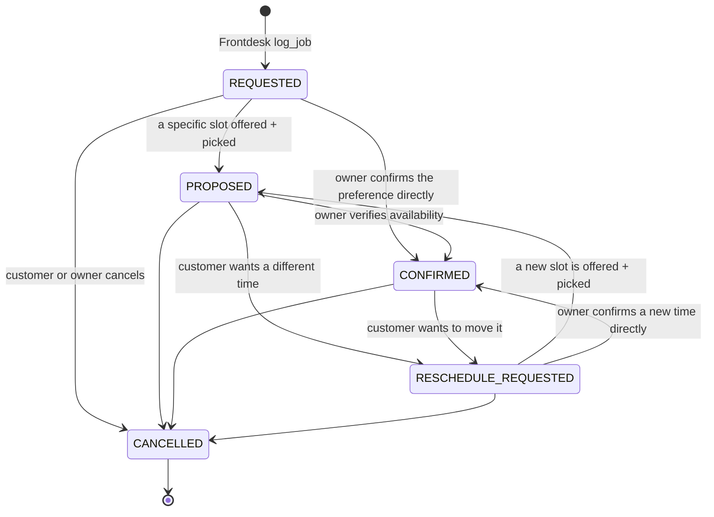

# Booking Management System — Architecture Design

_Status: **PROPOSAL — not approved, no code written.**_
_Author: Principal Engineer session, 2026-08-11._
_Verified against the production tree at commit `d77a40f` (currently deployed)._

> You asked me to challenge the proposal rather than follow it. I am accepting
> the core thesis and rejecting four specific parts of it, one of which would
> break four working employees. §3 is the challenge section; read it before §5.

---

## 1. The thesis is right

**A front desk employee who hangs up after taking a message is not a front desk
employee.** Today Roster stops at `log_job()` and the customer is left holding
"someone will reach out." That is honest, but it is not an office.

One correction to the problem statement, in Roster's favour: **Frontdesk
already doesn't book anything.** `AgentEngine.respond` returns captured
`log_job` inputs; `service.handle_customer_message` is what calls
`bookings.book_job` (`service.py:148`). The model never touches the database.
So "Frontdesk never books directly" is **already true** — what's missing is a
component on the other side of that call. This is a much smaller change than
the brief implies, and it means the AI prompt barely has to change.

---

## 2. Current booking flow (verified)

```
Customer → Frontdesk (log_job) → service.py → bookings.book_job()
    → Job row, booking_status = "requested"
    → eventbus.publish(job.booked)      [no subscribers]
    → notify_owner_of_booking()  → owner SMS
    → STOP
```

Three states exist today (`db_models.py:48`):

| State | Meaning | Who sets it |
|---|---|---|
| `requested` | A stated time preference only | `book_job` default — Frontdesk |
| `proposed` | A specific slot was offered and picked, still unverified | `recovery_service.confirm_slot` — Quote Chaser |
| `confirmed` | A human actually checked availability | `POST /clients/{id}/jobs/{id}/confirm` **only** (`app.py:947`) |

The honesty layer is already built and is genuinely good: `booking_language.py`
is the single authority on what "confirmed" may mean, with two enforcement
mechanisms — `render_slot_language()` raises if asked to phrase confirmation
for an unconfirmed booking, and a static audit test scans every production file
for banned phrases like `"you're booked for"`.

### 2.1 The actual holes

**Hole 1 — the loop never closes with the customer. [VERIFIED]**
`confirm_job` (`app.py:947`) sets `booking_status` and `confirmed_at`, commits,
and redirects. **It sends nothing.** A customer told "the office will reach out
to confirm" is never contacted by Roster again. The owner may phone them; from
Roster's side, silence. *This is the single most valuable thing to fix, and
it's small.*

**Hole 2 — there is no state for "the customer asked to move it."**
`_RESCHEDULE_NOTE` (`engine.py:171`) already instructs Frontdesk to recognize a
reschedule or cancellation and `log_job` it *with a note* — free text nothing
can query. The recognition exists; the destination doesn't.

**Hole 3 — three writers, no validation.** `book_job`, `confirm_job`, and
`recovery_service` each set `booking_status` independently. No transition is
validated; any status can follow any other.

**Hole 4 — no cancellation state at all.** A cancelled job is
indistinguishable from an open one.

---

## 3. Where I disagree with the proposal

### ❌ Challenge 1 — `COMPLETED` and `NO_SHOW` must not join this state machine

**This would break four working employees. [VERIFIED]**

`Job.completed_at` is the trigger for:

| Employee | Query | File |
|---|---|---|
| Reviews | `completed_at <= now - 1d` | `review_service.py:47` |
| Referral | `completed_at <= now - 4d` | `referral_service.py:37` |
| Membership | `completed_at <= now - 7d` | `membership_service.py:119` |
| Quote Chaser | `completed_at is not None and is_estimate` | `recovery_service.py:123` |

Fold completion into `booking_status` and you either rewrite all four or you
run two sources of truth for "is this job done" — the exact class of bug
`runner.is_active` was created to end.

There is also an existing, documented invariant against this. `db_models.py:45`
states that `booking_status` is *"only ever about the appointment TIME's own
certainty"* and that cancelled/declined belong to a different axis. The
proposal violates a rule the codebase already wrote down.

**Two axes, not one:**

```
booking_status  → the scheduling AGREEMENT   (requested → confirmed → cancelled)
completed_at    → the WORK                   (did it happen)
```

`NO_SHOW` is a third thing again — an outcome of a confirmed appointment.
Nothing in the system can observe it; only the owner can report it, and no
screen asks. **Defer it entirely.** Adding a state with no producer is how a
state machine rots.

### ❌ Challenge 2 — `RESCHEDULED` is an event, not a state

If a booking is `RESCHEDULED`, is the new time confirmed or not? The state
can't answer, which means it isn't a state. A reschedule *resolves back into*
`PROPOSED` or `CONFIRMED`.

`RESCHEDULE_REQUESTED` **is** real — it's a genuine waiting state with a
distinct meaning ("a time exists, the customer wants a different one, nobody
has agreed yet"). Keep it. Drop `RESCHEDULED`; record the fact in the audit
trail instead.

### ⚠️ Challenge 3 — the mandatory owner-confirm step is a product regression risk

This is my biggest concern and it isn't technical.

Today the owner does **nothing** and the customer gets an honest answer.
Proposed, **every booking blocks on the owner**. The owner is a plumber on a
roof at 2pm. If they don't look at their phone until 6pm, the customer sits in
limbo for four hours — having been told they'd hear back *"shortly."*

**That is worse than today.** Today's message promises nothing and disappoints
nobody; the proposed one makes a commitment the system can't keep.

Two consequences for the design, both mandatory:

1. **Owner confirmation must be SMS-first, not dashboard-first.** The owner
   already gets a text for every booking. Make that text actionable — reply
   `Y` and it's confirmed. A dashboard round-trip from a roof is not a
   workflow, and requiring one guarantees this feature goes unused.
2. **Never promise a timeframe.** "We'll confirm shortly" → "The office will
   confirm your time and text you back." Same information, no promise. This is
   the same discipline `booking_language.py` already enforces.

**Do not auto-confirm on a timeout.** It's the obvious escape hatch and it's
wrong: it re-introduces the exact lie the booking-honesty audit removed. An
unanswered request should escalate to the owner again, never self-approve.

### 🛑 Challenge 4 — SMS confirmation is blocked by a bug nobody has hit yet

**[VERIFIED — this is the finding that reorders the whole plan.]**

`_process_inbound_sms` (`app.py:1436`) resolves the business from `To`, then
treats `From` as a customer, unconditionally. `escalation_phone` appears in
`app.py` at only two places — lines 631 and 667, both in the *new client form*.
**The inbound SMS path has no concept of the owner's phone number.**

So today, if an owner replies to any Roster alert:

1. Their reply hits `/webhook/sms`.
2. The routing cascade finds no active recovery/membership/referral/review
   thread for that number.
3. It falls through to **Frontdesk**, which treats the owner as a customer and
   tries to book *them* a job.

An owner texting "Y" would get "Happy to help! What's the service address?"
and Roster would create a `Job` row for its own customer.

**This must be fixed before any SMS-based owner action exists.** It is
Milestone 0, ahead of everything else in this design.

### ❌ Challenge 5 — the proposed provider interface is the wrong shape

The proposed five methods — `create_booking`, `confirm_booking`,
`propose_new_time`, `cancel_booking`, `complete_booking` — would make the
Manual provider implement five methods that do **nothing external**, because in
manual booking there *is* no external system. That's an interface designed
against imagined future providers, and it puts state logic behind a seam where
each provider could implement it differently — which is precisely how the state
machine you're trying to centralize gets forked five ways.

**Correct split:**

```
BookingManager   owns: states, transitions, validation, audit, notifications
                 ALWAYS. For every provider. Never overridable.
       ↓
BookingProvider  owns ONLY the two things that genuinely vary:
                 1. can I see real availability?
                 2. does an external system need to be told?
```

Manual provider then honestly answers "no" and "no" — one small class, not five
no-ops. Google Calendar answers "yes" and "yes". ServiceTitan answers "yes",
"yes", and adds technician assignment.

This is also the shape the codebase already uses twice: `channels.SMSChannel`
and `calendar_provider.CalendarProvider` are both narrow `Protocol`s with a
console/manual fallback. Following that precedent beats inventing a new
pattern.

### ✅ What I'm accepting unchanged

- **Frontdesk never books directly** — already true; formalize it.
- **Single writer for booking state** — correct, and it strengthens the
  existing "only `/confirm` may set CONFIRMED" rule rather than weakening it.
- **Explicit states** — correct; three exist, we add two.
- **Provider abstraction so integrations don't touch Frontdesk** — correct
  goal, different seam (Challenge 5).
- **Manual provider works for every business with no FSM software** — correct,
  and it's the only provider worth building now.

---

## 4. The state machine (revised)

Six states. `COMPLETED` and `NO_SHOW` are deliberately absent — completion
stays on `completed_at`.



| State | Means | Reachable by |
|---|---|---|
| `REQUESTED` | A stated preference only | Frontdesk (existing default) |
| `PROPOSED` | A specific slot offered and picked, **not verified** | Quote Chaser, future providers |
| `CONFIRMED` | **A human or a real calendar verified it** | Owner action only |
| `RESCHEDULE_REQUESTED` | Customer wants a different time | Frontdesk, owner |
| `CANCELLED` | Terminal, no appointment | Customer, owner |

**The one rule that must never bend:** nothing automated may reach `CONFIRMED`
while the configured provider reports `supports_availability() == False`. Under
the Manual provider that means a human. Under a future Google Calendar
provider, a real free/busy check earns it — and that is the *only* thing that
changes.

**`CANCELLED` is terminal.** A customer who comes back gets a new `Job`. This
avoids resurrection semantics and keeps every downstream `completed_at` query
untouched.

---

## 5. Booking Manager

One module. The **only** writer of `Job.booking_status` anywhere in the
codebase.

**Responsibilities:** validate the transition against the table above; write
the status and its timestamp; write an audit event; decide who gets told and
send it; delegate to the provider for availability and external sync.

**Public surface** (descriptive — no code in this document):

| Operation | Called by | Effect |
|---|---|---|
| `request(...)` | `service.py` on Frontdesk's `log_job` | Creates/merges the Job at `REQUESTED`, notifies the owner |
| `propose(job, slot)` | Quote Chaser's `confirm_slot` | `→ PROPOSED`, tells the customer the honest sentence |
| `confirm(job, actor)` | Owner (console or SMS) | `→ CONFIRMED`, **texts the customer** |
| `request_reschedule(job, reason)` | Frontdesk, owner | `→ RESCHEDULE_REQUESTED`, notifies the owner |
| `suggest_time(job, slot)` | Owner | Stays `RESCHEDULE_REQUESTED`/`PROPOSED`, texts the customer the owner's time |
| `cancel(job, actor, reason)` | Owner, customer | `→ CANCELLED`, notifies the other side |

**Every method is idempotent**, following `confirm_job`'s existing posture: if
the job is already in the target state, do nothing and return success. A
double-click, a Twilio retry, and a stale tab all resolve to one transition.

**Every method is a no-op on an illegal transition** and raises rather than
silently writing — `CANCELLED → CONFIRMED` must fail loudly.

### Audit trail

Use the **existing `Event` table** (`db_models.py:564`) rather than inventing a
second audit log. It is already append-only, already deduplicated on
`dedup_key`, and already written to by `book_job`. Booking transitions are
exactly the append-only causal history that table exists for.

New event types: `booking.requested`, `booking.proposed`, `booking.confirmed`,
`booking.reschedule_requested`, `booking.cancelled`, with `dedup_key =
booking.{state}:{job_id}:{attempt}`.

**Honest note:** nothing reads the `Event` table today (zero subscribers,
verified). These events are for humans reading history and for `/health`, not
for triggering work. Writing them costs one insert and finally gives the stream
a reason to exist.

---

## 6. Provider interface

Narrow by design (per Challenge 5).

| Member | Manual | Google Calendar | ServiceTitan |
|---|---|---|---|
| `supports_availability()` | `False` | `True` | `True` |
| `get_available_slots(...)` | Invented plausible windows (today's behaviour) | Real free/busy | Real dispatch board |
| `sync_confirmed(job)` | No-op | Create calendar event | Create job + assign tech |
| `sync_cancelled(job)` | No-op | Delete event | Cancel job |
| `external_ref` | `None` | Event id | Job id |

Selected per business by a new `Business.booking_provider` column, default
`"manual"`. `calendar_provider.get_calendar_provider` already takes a `client`
argument and ignores it (`calendar_provider.py:38`) — that function becomes the
provider registry rather than a hardcoded return.

**Sync is best-effort and strictly subordinate**, following the rule already
used for events and owner notifications (`bookings.py:69`): the state
transition commits first; a failed external sync is logged and retried, and can
never roll back the booking. A booking that exists in Roster but not yet in
Google Calendar is recoverable. The reverse is not.

---

## 7. Notification flow

### Owner — actionable SMS (the core of Phase 1)

Today: `📋 Frontdesk just booked a job: AC not cooling (same_day) for Dana
Reyes. Callback: +1555…`

Proposed:
```
📋 New request #412 — Dana Reyes
AC not cooling (same_day)
44 Oak Street
Prefers: Thursday afternoon

Reply Y412 to confirm · N412 to reject
· or text a better time
```

**Why the id is in the token:** an owner with three pending requests replying
`Y` is ambiguous. Embedding the job id makes every reply unambiguous with no
conversational state. If a bare `Y` arrives and exactly one request is pending,
accept it; if more than one is pending, ask which. That's the smallest correct
rule.

### Customer

| Moment | Message |
|---|---|
| Request taken | "Got it — {preference} noted as what works best for you. The office will confirm your time and text you back." *(existing `render_slot_language(REQUESTED)`, with the promise-free ending)* |
| **Owner confirms** | **"You're confirmed for {time}. See you then!"** — the first time this sentence is ever legal, because `CONFIRMED` is genuinely true |
| Owner suggests another time | "The office can do {time} instead — does that work?" |
| Owner rejects | "Unfortunately we can't make that work. {reason}" |
| Cancelled | "Your request has been cancelled. Text us any time." |

`booking_language.render_slot_language()` gains a `CONFIRMED` branch — today it
deliberately **raises** for confirmed (`booking_language.py:98`) because no
honest caller existed. Booking Manager becomes that caller, and the raise stays
for everyone else.

---

## 8. Database changes

Additive only. `db._migrate_add_columns` handles this; there is no
down-migration path, so nothing may be altered or dropped.

| Table | Change | Why |
|---|---|---|
| `Job` | `booking_status` — two new allowed values | It's already a plain string; no schema change |
| `Job` | `cancelled_at`, `reschedule_requested_at` (nullable) | Match the existing `confirmed_at` pattern |
| `Job` | `booking_notes` (nullable) | The owner's reject/suggest reason |
| `Business` | `booking_provider` (default `"manual"`) | Provider selection |
| `Event` | *(no change)* | Reused as the audit trail |

**No backfill.** Every existing row has `booking_status = "requested"`, which
is a valid state in the new machine. **[VERIFIED]** — it is the column default.

**Deliberately not added:** a `Booking` table separate from `Job`. Splitting
them would fork every `completed_at` query in the four employees listed in
Challenge 1. The `Job` row *is* the booking; it just gains a proper lifecycle.

---

## 9. Conversation and dashboard changes

**Frontdesk prompt — minimal.** `_RESCHEDULE_NOTE` already tells the model to
recognize reschedules; it gains a structured destination rather than a note.
`_PREFERRED_WINDOW_NOTE` and `_CONFIRMATION_HONESTY_NOTE` are unchanged —
Frontdesk still may never claim a confirmation, because it still cannot verify
one.

**Founder console** (`/clients/{id}`): the existing Confirm button becomes a
Booking Manager call; add **Reject** and **Suggest another time**, and show the
booking state per job.

**Customer dashboard** (`/v2/dashboard*`): read-only, and it must go through
the view-model layer. `ARCHITECTURE.md`'s eleven invariants apply in full —
notably #9 (no dead controls: never render a Confirm button whose transition
would be rejected) and #10 (no fabricated metrics). **No new top-level page** —
this deepens the existing Department/Employee workspaces.

---

## 10. Failure, retry, idempotency

| Failure | Behaviour |
|---|---|
| Owner SMS fails to send | Transition **still commits**; `OwnerNotification.delivered = False`. Existing best-effort posture (`notifications.py:255`) |
| Customer confirmation SMS fails | Transition still commits; logged with `job_id`. **Retried by the hourly tick** — see below |
| Owner replies `Y412` for a job in another business | Rejected — business scoping is the security boundary; the job id is validated against the business that owns the inbound number |
| Owner replies `Y` with 3 pending | Roster asks which one |
| Illegal transition | Raises, nothing written, logged |
| Provider sync fails | Booking stands; sync retried on the tick |
| Twilio retries the owner's reply | `WebhookDelivery` replays the cached TwiML (`app.py:1400`) — no second transition |
| Two owners confirm at once | Conditional UPDATE claim on `booking_status`, exactly like `recovery_service.tick`'s day claim (`recovery_service.py:252`) |

**Retry belongs on the tick, not in-band.** Add one step to
`recovery_tick.run()`: find bookings whose confirmation SMS or provider sync
never succeeded and retry them. This reuses the reconciler pattern the system
already relies on — idempotent, gated by a timestamp column, safe to run
hourly. **No new queue, no new infrastructure.**

Note this send is subject to `send_hours_ok()` (17:00–23:59 UTC, ~7 hours/day)
if it goes out on the tick. A confirmation sent *inline* when the owner
confirms is a live interaction and is **not** quiet-hours gated — the same
distinction `recovery_service.py:323` already draws for live-reply owner pages.

---

## 11. Migration strategy

Every stage independently deployable and revertable.

**M0 — Owner-phone recognition (BLOCKER, ship alone).**
Teach `_process_inbound_sms` that a `From` matching this business's
`escalation_phone` is the owner, not a customer. Today it isn't, and the owner
gets booked a job (Challenge 4). Ship and verify this **before** any owner SMS
action exists. Small, self-contained, fixes a live bug regardless of whether
the rest of this design is ever built.

**M1 — Booking Manager as the single writer. Zero behaviour change.**
Introduce the module and the transition table. Route the three existing writers
(`book_job`'s default, `recovery_service.confirm_slot`, `confirm_job`) through
it. Same states, same messages, same outcomes — a pure refactor with the
transition table now enforced. Revert = restore three call sites.

**M2 — Close the loop with the customer.**
`confirm()` texts the customer. Adds the `CONFIRMED` branch to
`render_slot_language`. **This alone fixes Hole 1 and is the highest-value item
in the whole document.** Gate per business via `booking_provider` so the first
real customer is deliberate.

**M3 — Actionable owner SMS.**
`Y412` / `N412` / free-text time, on top of M0. Console gains Reject and
Suggest.

**M4 — `RESCHEDULE_REQUESTED` and `CANCELLED`.**
Frontdesk's existing recognition gains a destination.

**M5 — Provider seam.**
Extract `BookingProvider`, add `Business.booking_provider`, move
`ManualCalendarProvider` behind it. **Still one implementation** — this only
earns its keep when a paying customer names their tool, per ROADMAP.md's
standing rule. Do not build a second provider speculatively.

---

## 12. Testing strategy

- **Transition table:** every legal transition, and **every illegal one
  rejected**. Table-driven, one case per cell.
- **Extend the existing static audit** (`test_booking_honesty.py`) so the new
  states can't reintroduce a confirmation claim. The `CONFIRMED` branch is the
  first legal use of that language — the test must prove it's reachable *only*
  through a genuine confirm.
- **Owner-phone routing (M0):** an owner's inbound text must never reach
  `handle_customer_message`. This is a regression test for a live bug.
- **Idempotency:** every Booking Manager method called twice produces one
  transition, one event, one SMS.
- **Structural guard**, matching `ARCHITECTURE.md` invariant 3's precedent:
  assert that `Job.booking_status` is assigned in exactly one module. A test
  that greps production source for other writers is how "single writer" stays
  true in a year.
- **Real-Claude verification**, not just stubs: the codebase's own tests stub
  the engine, and that is precisely how the "you're booked for Wednesday" bug
  survived. Adversarially press Frontdesk on confirmation wording before
  shipping M2.

---

## 13. Deployment strategy

Railway auto-deploys from `main`; each milestone is one PR. Pre-push gates are
already defined in `docs/runbook.md`: `ruff check . && ruff format --check .
&& mypy`, then `pytest -q` green.

- M0/M1 are behaviour-neutral → deploy normally.
- **M2 is the first real behaviour change** (customers receive a new text).
  Gate on `booking_provider` per business; enable for one pilot first.
- Schema changes are additive only — a bad schema change is a
  restore-from-backup situation, not a quick fix.
- Rollback: Railway redeploys the prior commit. Because every change is
  additive and every transition idempotent, a rollback leaves valid data.

---

## 14. Recommendation

**Build M0 now regardless of this design's fate** — it fixes a live bug where
an owner texting their own Roster number gets booked a job.

**Then M1 + M2 as one thin slice.** Together they are the smallest change that
makes Roster an office instead of a message-taker: one writer for booking
state, and the customer actually hears back when the owner confirms. Everything
after that is genuine improvement but not the thing that's broken.

**Defer M5 (the provider seam) until a paying customer names their FSM.** The
interface is designed here so that when it arrives, Frontdesk doesn't change —
which was the goal. Building it before then is an interface with one
implementation, and ROADMAP.md's standing guardrail already calls that.

**Do not build:** `COMPLETED`/`NO_SHOW` states (Challenge 1), `RESCHEDULED`
(Challenge 2), timeout auto-confirmation (Challenge 3), or a second provider
(§11 M5).

---

## 15. Open questions

1. **Does every booking need owner confirmation, or only some?** A $12,000
   replacement deserves a human. A routine tune-up during business hours may
   not. A per-business setting ("confirm everything" vs "confirm high-value
   only") would preserve today's zero-friction path for shops that want it.
   **My recommendation: ship M2 confirming everything, and add the setting only
   if a real owner asks** — the fewer knobs before evidence, the better.
2. **What happens when the owner never responds?** My position: escalate again,
   never auto-confirm. How many reminders, and after how long?
3. **Should the customer be able to cancel by text?** Frontdesk already
   recognizes cancellations. Wiring it to `cancel()` is small, but it lets a
   customer cancel a job the owner has already scheduled a truck for.
4. **Does M2's confirmation SMS go out inline or on the tick?** Inline is
   instant and not quiet-hours gated (a live owner action); tick-based is
   uniformly rate-limited. **My recommendation: inline** — the owner just acted,
   and the customer is waiting.
